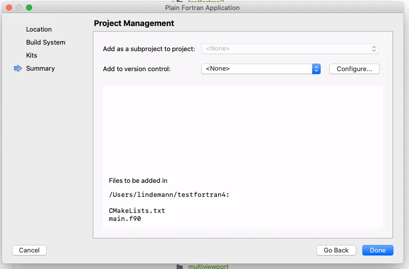

Setting up a Fortran Environment
================================

Windows
-------

Installing Qt Creator with Fortran compiler
^^^^^^^^^^^^^^^^^^^^^^^^^^^^^^^^^^^^^^^^^^^

* https://www.qt.io/download-qt-installer

Installing Qt Creator extensions for Fortran
^^^^^^^^^^^^^^^^^^^^^^^^^^^^^^^^^^^^^^^^^^^^

* https://github.com/jonaslindemann/qtcreator-fortran

macOS
-----

To be able to compile fortran code on macOS you need a fortran compiler. The easiest way to get this is to install the Homebrew packaging system. MacPorts also works, but they install to different paths.

Installing required packages (Homebrew)
^^^^^^^^^^^^^^^^^^^^^^^^^^^^^^^^^^^^^^^

Installation of Homebrew can be found at https://brew.sh/ (Links to an external site.)

To install the required packages for this course, open a terminal in macOS and enter the following commands:

.. code-block:: bash

	brew install gcc
	brew install gdb
	brew install cmake
	brew cask install qt-creator
	brew install wget

Installing Qt Creator
^^^^^^^^^^^^^^^^^^^^^

Qt Creator can be downloaded and installed from:

https://www.qt.io/download-qt-installer

Installing the Qt Creator Fortran extensions
^^^^^^^^^^^^^^^^^^^^^^^^^^^^^^^^^^^^^^^^^^^^

To use Fortran in Qt Creator some extra extensions must be installed. Instructions for this is found here:

https://github.com/jonaslindemann/qtcreator-fortran

Configuring Qt Creator for Fortran
^^^^^^^^^^^^^^^^^^^^^^^^^^^^^^^^^^

To be able to use the Fortran compiler in Qt Creator it has to be configured to find the compiler, debugger and CMake. Open the preferences i Qt Creator as shown below:

In the preferences select the Kits section. Make sure the Desktop kit is the default and has the settings as shown in the figure below:

Creating a Fortran project in Qt Creator
To create a new Fortran project i Qt Creator, select File/New file or Project in the menu.  The following dialog is shown:

From the Projects section select Non-Qt Project and Plain Fortran Application. Continue by clicking Choose...

Give you project a name as shown in the figure below:

Make sure the build system is CMake.

Select the Desktop kit, which we configured earlier.

Click Done in the next section.

If everything works the Qt Creator should look like the following figure:

Run the project by clicking on the play button (lower left corner).

Linux
-----

Installing Fortran compiler
^^^^^^^^^^^^^^^^^^^^^^^^^^^

RHEL/Fedora:

.. code-block:: bash

    sudo dnf install gcc-gfortran

Debian/Ubuntu (Windows WSL):

.. code-block:: bash
    
    sudo apt-get install gfortran

Installing CMake
^^^^^^^^^^^^^^^^

RHEL/Fedora:

.. code-block:: bash

    sudo dnf install cmake

Debian/Ubuntu (Windows WSL):

.. code-block:: bash
    
    sudo apt-get install cmake

Installing Qt Creator
^^^^^^^^^^^^^^^^^^^^^

Qt Creator can be downloaded and installed from:

https://www.qt.io/download-qt-installer

