Running Python code
===================

Python is a script language and Python code can be run in many different ways. This chapter will try to cover all the ways you can run your Python code.

Executing code from the command line (python)
---------------------------------------------

All Pytho installations comes with an interpreter for Python. This is a command line tool that can be used to execute Python code. Just running the interpreter without any arguments starts an interactive Python prompt as shown below::

    (base) C:\Users\jonas>python
    Python 3.9.7 (default, Sep 16 2021, 16:59:28) [MSC v.1916 64 bit (AMD64)] :: Anaconda, Inc. on win32
    Type "help", "copyright", "credits" or "license" for more information.
    >>>

The **>>>** is the Python interactive prompt. Here you can enter python commands and functions directly. In the following example 3 python variables are created and finally the variable **c** is printed.::

    >>> a = 42
    >>> b = 32
    >>> c = a + b
    >>> print(c)
    74

Using the Python interactive shell enables you to do experiment with Python interactively. To exit the interpreter press **Ctrl-Z**.

Running Python source files (.py)
---------------------------------

The interpreter can also execute Python code from text files, usually with the **.py** extension. The code shown in the interactive example can be put in a source file, **mycode.py**, with the following content:

.. code-block:: python

    # -*- coding: utf-8 -*-

    a = 42
    b = 32
    c = a + b
    print(c)

The first line is not required, but tells Python that the source code can contain unicode characters (öäå). This source file can then be executed by calling the **python** command with the Python source file as the first argument.::

    (base) C:\Users\jonas\Development\compute-course-docs\examples>python mycode.py
    74

Running Python source files in Visual Studio Code
-------------------------------------------------

When the Python-plugins has been installed in Visual Studio Code (VSCode) it is possible to run Python-source files directly in the application. If a Python source file is open a special toolbar is shown in the top right corner with a play-button as shown in the followin figure:

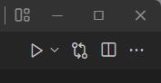

Before we can runt the source file in VSCode, the correct Python interpreter must be selected. Selecting a Python interpreter is done by clicking in the status bar in the lower right corner of the window.

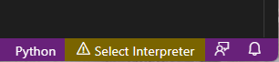

This brings up a list of all the installed Python interpreters. Select the one you want to use. The default Anaconda interpreter is prefixed with **(base)**.

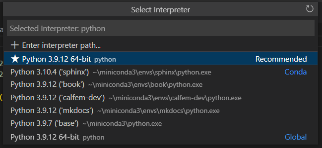

When an interpreter has been selected it is now possible to execute the Python source by clicking the play-button. This will open an output pane in VSCode and show execution and output from the execution of the source file.

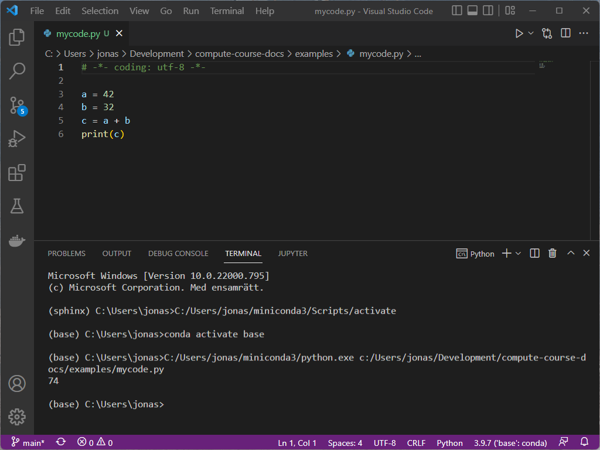

Running Python source files in Spyder
-------------------------------------

Spyder is the default development environment that comes with the Anaconda distribution. Spyder uses the default Python interpreter in the base environment of the Anaconda distribution. 

Running a Python source file in Spyder is done by opening it using **File/Open..** menu and choosing **Run/Run** menu. It is also possible to use the function key **F5** directly. This executes the source file and shows the output in the Console tab in the lower right of the window.

Spyder always asks you where you want to execute the Python file, by displaying the following dialog:

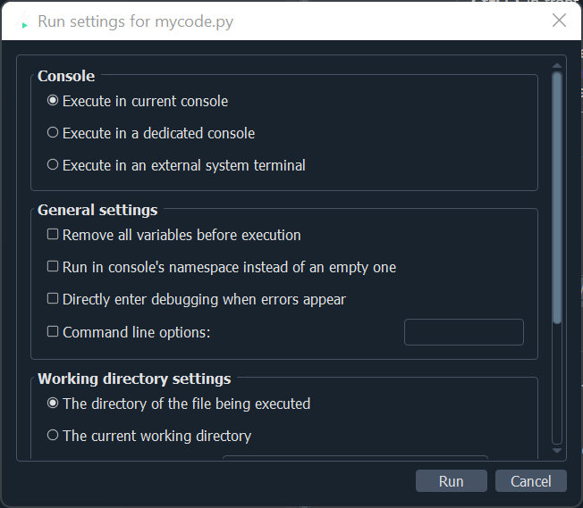

By default is uses the Python interpreter running in the **Console**-tab in the lower right. The second option is running in a dedicated console. This alternative will start a new Python interpreter running in a separate tab. The third option is to run in an external terminal. As Spyder is also a Python application it can sometimes be beneficial to run your code outside the Spyder environment. This is especially important when developing graphical user interface applications (PyQt). 

When running in the default console it can be a good idea to check the option **Remove all variables before execution**, otherwise all existing variables from the last run are kept.

If there where no errors the output is shown in the console tab.

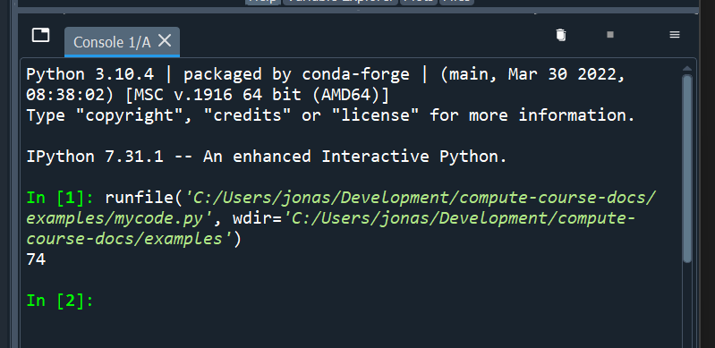

Running Jupyter-notebooks
-------------------------

Another way to run Python code is to use Jupyter-Notebooks. In the Anaconda distribution a notebook can be started using the **jupyuter-notebook** command. This will start a notebook web server running on your local computer. The url will to access the server is displayed in the output from the command:

.. code-block:: 

    (base) C:\Users\jonas\Development\compute-course-docs>jupyter-notebook
    [I 10:39:47.869 NotebookApp] Writing notebook server cookie secret to C:\Users\jonas\AppData\Roaming\jupyter\runtime\notebook_cookie_secret
    ...
    [C 10:39:48.772 NotebookApp]

        To access the notebook, open this file in a browser:
            file:///C:/Users/jonas/AppData/Roaming/jupyter/runtime/nbserver-19148-open.html
        Or copy and paste one of these URLs:
            http://localhost:8888/?token=089...88
        or http://127.0.0.1:8888/?token=089...88

In most cases the **jupyter-notebook**-command will try to open the url automatically in your browser. The server can be stopped by clicking **Ctrl-C** multiple times.

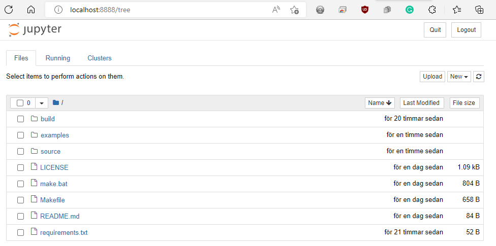

There is a second command that starts a more advanced notebook server, **jupyter-lab**:

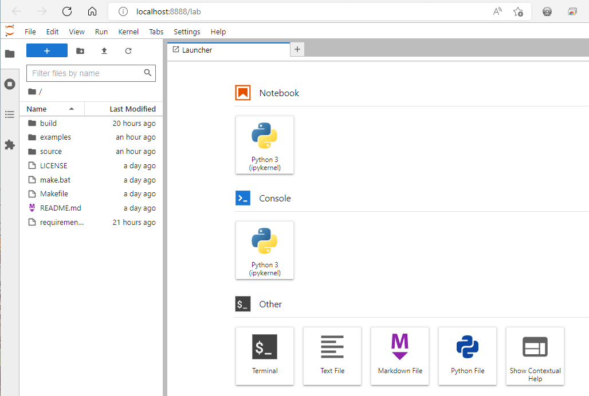

The jupyter-lab server can also be used to edit and run python source files (.py). To do this you have to open the source file and create a Python console/interpreter for the opened editor. To do this, right-click in the editor window and select **Create Console for Editor**.

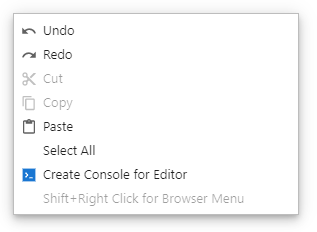

This brings up a dialog asking for what kind of Python interpreter you want:

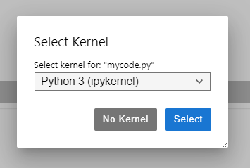

Click **Select** to continue. This opens up a lower pane with the started interpreter. To run code select **Run/Run All code** from the menu in Jupyter-lab.

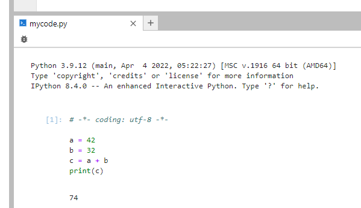

