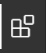
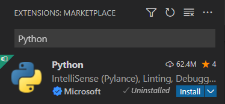

Setting up a Python environment
===============================

Installing Python distribution Anaconda
---------------------------------------

Anaconda is a prepackaged Python distribution for scientific computing. The distribution can be downloaded from here:

https://www.anaconda.com/

Run the installer to install Anaconda. 

Using Anaconda in Windows
^^^^^^^^^^^^^^^^^^^^^^^^^

The installer will create a shortcut to an **Anaconda command prompt**, which opens a terminal with the paths setup for running Python and other Anaconda installed tools.

To verify that Anaconda has been installed correctly type the following commands in a command prompt (versions can differ):

.. code-block:: 

    (base) C:\Users\jonas\Development\compute-course-docs>python -V
    Python 3.9.7
    (base) C:\Users\jonas\Development\compute-course-docs>conda --version
    conda 4.13.0

Using Anaconda on macOS
^^^^^^^^^^^^^^^^^^^^^^^

The installer will update the Terminal-scripts with search paths for the Anaconda install. To access the Anaconda provided tools and Python, open the **Terminal** application in macOS.

To verify that Anaconda has been installed correctly type the following commands in a command prompt (versions can differ):

.. code-block:: bash

    (base) $ python -V
    Python 3.9.7
    (base) $ conda --version
    conda 4.13.0

Starting the Development environment Spyder
^^^^^^^^^^^^^^^^^^^^^^^^^^^^^^^^^^^^^^^^^^^

The default development environment for Anaconda and scientific development is Spyder, which is installed together with Anaconda. The Spyder development environment can be started by typing **spyder** in an anaconda prompt or terminal.

.. code-block:: bash

    (base) $ spyder

Installing Visual Studio Code
-----------------------------

Visual Studio Code is general code editor from Microsoft supporting multiple languages through a plugin architecture. Microsoft also provides excellent Python support through their own Python-plugins. Visual Studio Code is available for all platforms and can be downloaded from here:

https://code.visualstudio.com/

Installing Visual Studio Python extensions
^^^^^^^^^^^^^^^^^^^^^^^^^^^^^^^^^^^^^^^^^^

To make it possible to run Python and notebooks in Visual Studio Code we need to install some additional Plugins. The first one is the general Python plugin. To install plugins click on the plugins-button in the toolbar to the left in visual studio code:

Next, enter **Python** in the search bar top left in the window:

Click the **Install** button to install the plugin in Visual Studio Code.

If you want to open Jupyter Notebooks directly in Visual Studio Code, this can be enabled by installing the following plugins:

* Jupyter - Microsoft
* Jupyter Keymap - Microsoft
* Jupyter Notebook Renderers - Microsoft

