Installing a Python environment
===============================

Installing Conda-Forge on Windows
---------------------------------

This document provides a step-by-step guide to installing Conda-Forge on Windows. Conda-Forge is a community-driven collection of conda packages that are built and maintained by the community. 

Step 1: Downloading Conda-Forge installer
^^^^^^^^^^^^^^^^^^^^^^^^^^^^^^^^^^^^^^^^^

Go to the `Conda-Forge page <https://conda-forge.org>`_ and download the Anaconda installer for Windows.

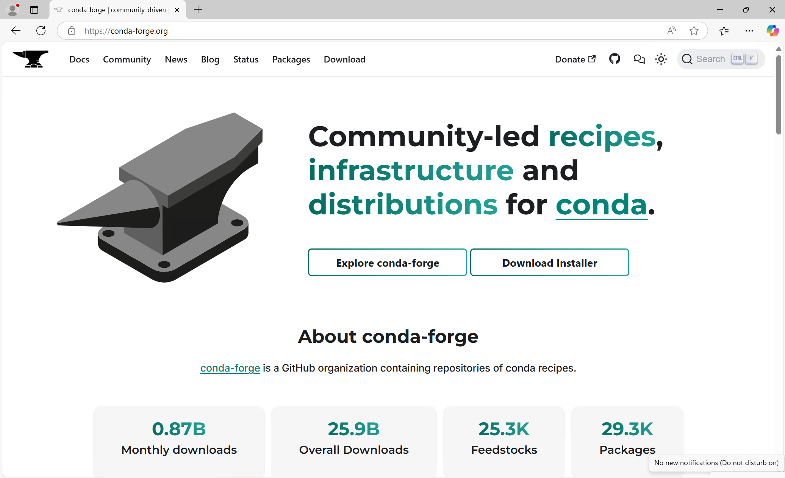

Click on the button **Download Installer**.

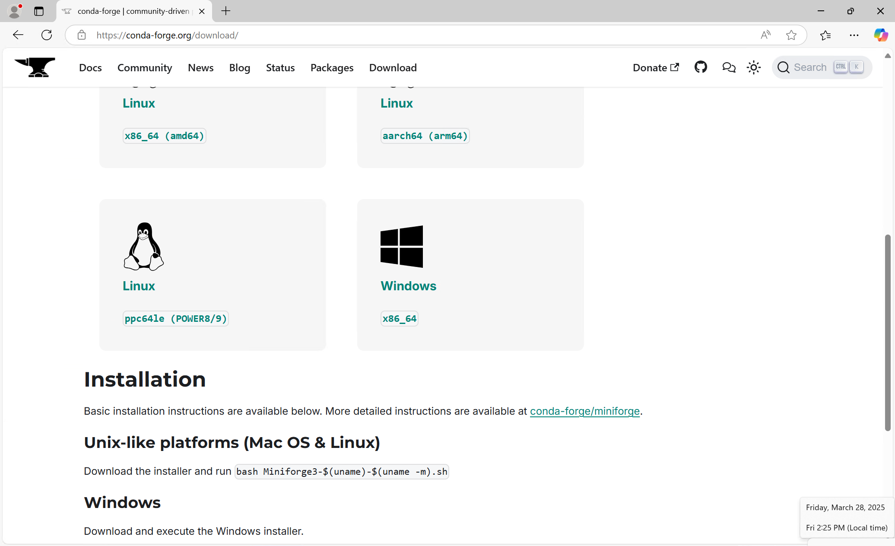

Click on the **Windows** Button to download the installer for Windows.

A download message will appear on the top right corner of your browser. Click on the **Open file** when the download has completed.

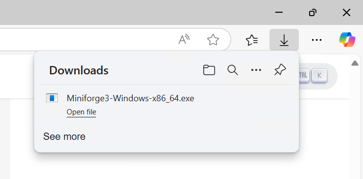

Step 2: Installing Conda-Forge
^^^^^^^^^^^^^^^^^^^^^^^^^^^^^^ 

When the installer opens, you will see a welcome screen. 

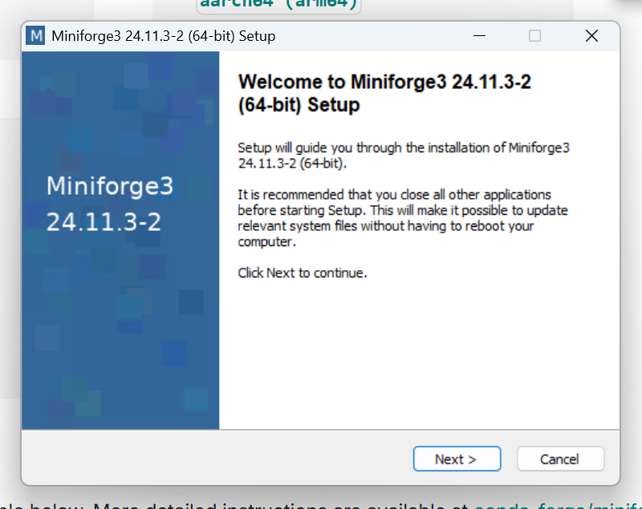

Click on **Next** to continue. The following page will be displayed:

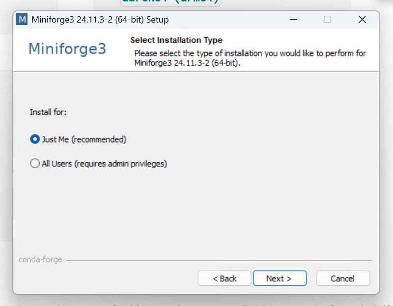

Select the option **Install only for me** and click on **Next**. The following page will be displayed:

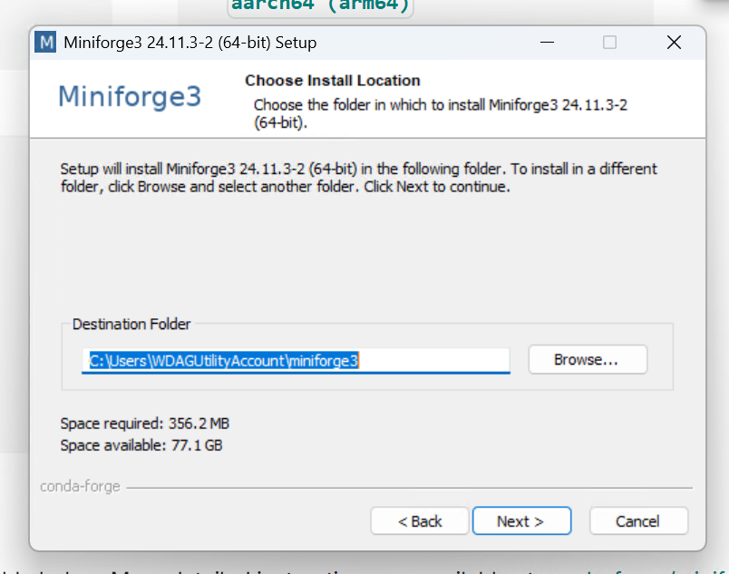

Leave the suggested location for the installation and click on **Next**. The following page will be displayed:

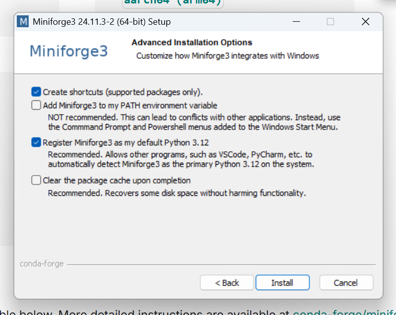

Here it is important to select the option "Register Anaconda as my default Python 3.x". This will ensure that the Conda-Forge packages are available in your Python environment. Click on **Next** to continue. The installation of Conda-Forge will start and the following page will be displayed:

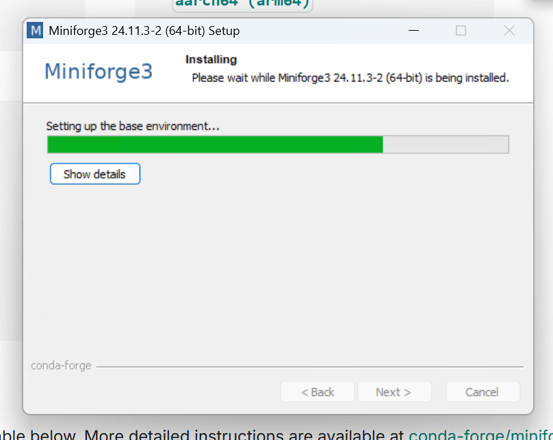

When this dialog has finished the Conda-Forge installation is complete.

Step 3: Opening an Conda-prompt
^^^^^^^^^^^^^^^^^^^^^^^^^^^^^^^

Press the **Start** button in Windows. This should bring up the following menu.

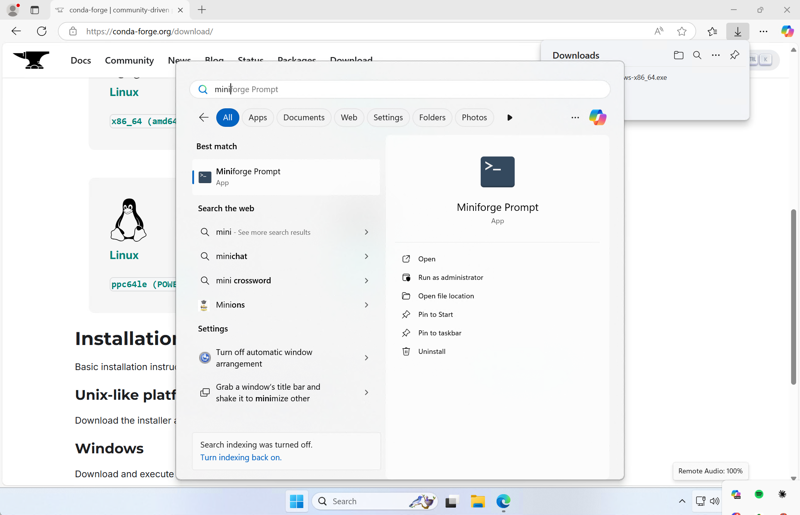

In the top part of the start menu enter miniforge. This should show the shortcut for the Miniforge prompt. Click on the **Miniforge Prompt** to open a command line window as shown below:

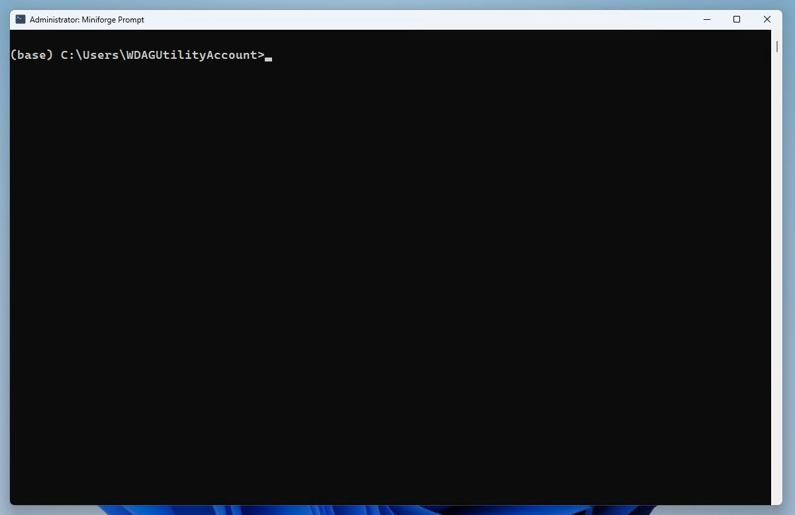

To install the required packages for this course we create an environment. An environment is a self-contained installation of Python with its own set of packages. This allows you to have multiple versions of Python and packages installed on your system without conflicts. To create an environment called `compute-env` with Python 3.8, run the following command in the Miniforge prompt:

.. code-block:: console

   conda create -n compute-env python=3.13 numpy scipy matplotlib qtpy pyqt 

Running this command will check for the required packages and their dependencies. If everything is ok, you will be prompted to confirm the installation. Type `y` and press enter to continue.

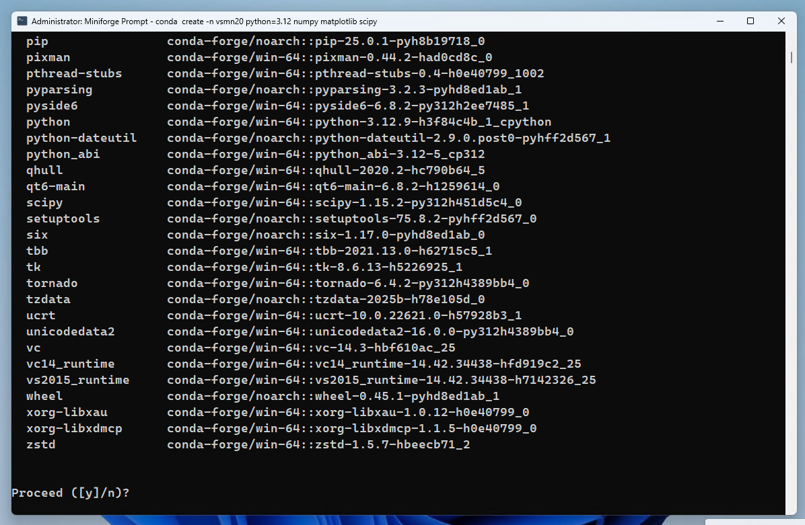

When the installation completes, you will see the following message:

.. code-block:: console

   Downloading and Extracting Packages:

   Preparing transaction: done
   Verifying transaction: done
   Executing transaction: done
   #
   # To activate this environment, use
   #
   #     $ conda activate compute-env
   #
   # To deactivate an active environment, use
   #
   #     $ conda deactivate

To use this environment in the future, you need to activate it. To do this, run the following command in the Miniforge prompt:

.. code-block:: console

   conda activate compute-env

This will activate the `compute-env` environment and you will see the following message:

.. code-block:: console

   (compute-env) C:\Users\YourUsername>

This indicates that you are now in the `compute-env` environment and any packages you install or run will be from this environment.
To deactivate the environment, run the following command:

.. code-block:: console

   conda deactivate

This will deactivate the `compute-env` environment and return you to the base environment.

Step 5: Installing Visual Studio Code
^^^^^^^^^^^^^^^^^^^^^^^^^^^^^^^^^^^^^

Download Visual Studio Code from here:

https://code.visualstudio.com/Download

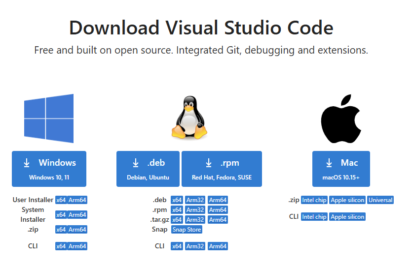

Click on the **open file** when the download has completed.

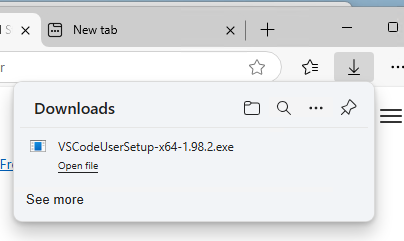

When running the installer the first time it will show a warning that the installer is not meant to be run as an administrator. This is OK. Press **OK** to continue.

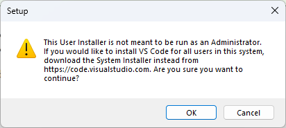

A welcom page is shown asking you to accept the license agreement. Press **I accept the agreement** and click on **Next**.

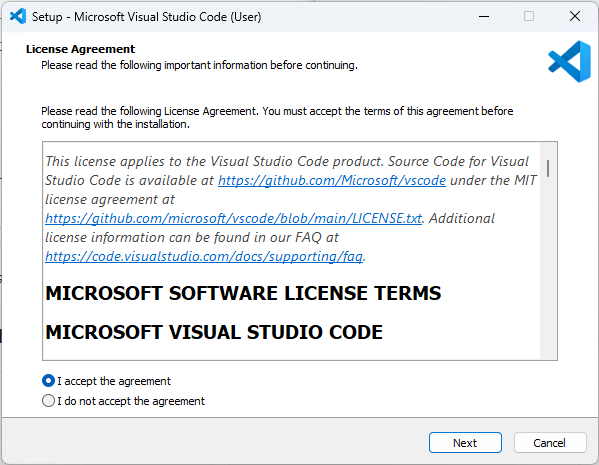

Next a page is shown where you can select the installation folder. Leave the default folder and click on **Next**.

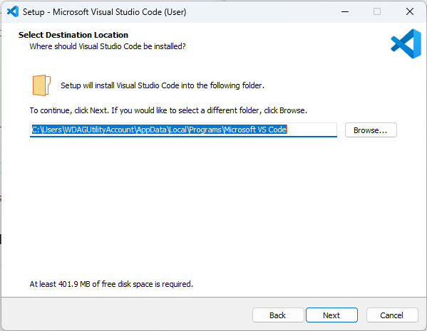

In the next page just accept the default name of the shortcut to be created. Click on **Next**.

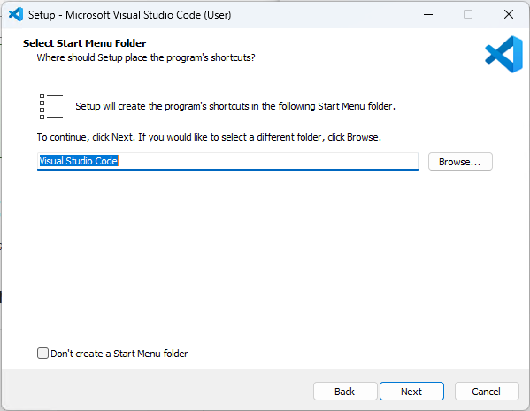

In the next page it is important that you select all checkboxes. This will ensure that Visual Studio Code is added to the PATH and that the file types are associated with Visual Studio Code. Click on **Next**.

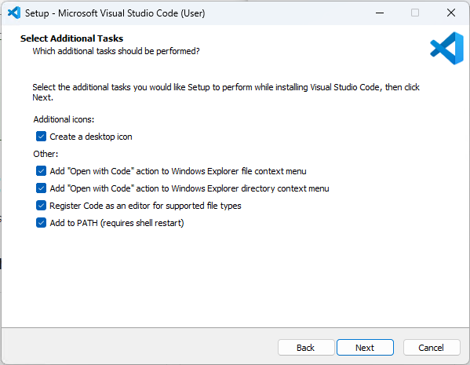

Click on **Install** to start the installation.

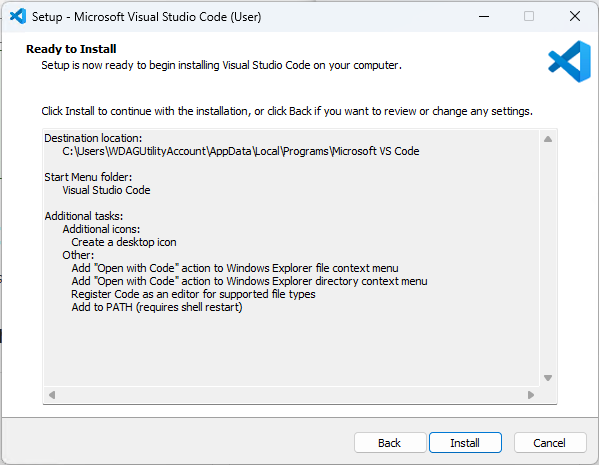

When the installation is complete, you will see the following message:

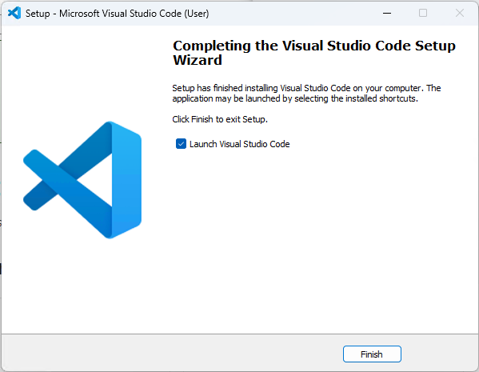

Leave the checkbox **Launch Visual Studio Code** checked and click on **Finish**.
This will start Visual Studio Code.

Step 6: Installing the Python extension for Visual Studio Code
^^^^^^^^^^^^^^^^^^^^^^^^^^^^^^^^^^^^^^^^^^^^^^^^^^^^^^^^^^^^^^

I the left toolbar click on the **Extensions** icon. This will open the extensions view.

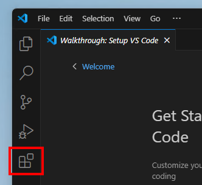

In the search box enter **Python**. This will show the Python extension for Visual Studio Code.
Click on the **Install** button to install the extension.

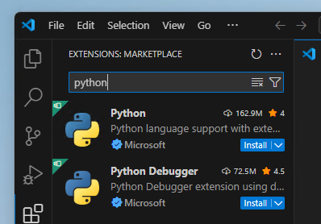

Next, create a new file by clicking on the **File/New file...** in the menu. This will open a file type selection dialog.

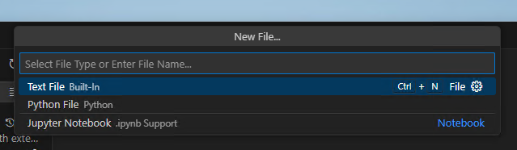

In the file type selection dialog select **Python**. This will create a new Python file.

In the next step we will need to select the Python interpreter. This is the Python version that will be used to run the code. To select the Python interpreter, click on the **Select interpreter** icon in the bottom right corner of Visual Studio Code.

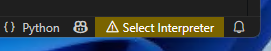

This will open a list of available Python interpreters. Select the one that corresponds to the `compute-env` environment we created earlier. This should be something like `C:\Users\YourUsername\Miniforge3\envs\compute-env\python.exe`.

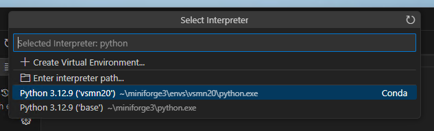

When this has been done, everytime you open a Python file in Visual Studio Code, it will show a play button in the top right corner. This will run the code in the file using the selected Python interpreter. Below shows what happens when you click on the play button.

.. image:: images/vc-install-16.png
   :alt: Visual Studio Code

Installing Conda-Forge on macOS / Linux
---------------------------------------

This document provides a step-by-step guide to installing Conda-Forge on macOS. Conda-Forge is a community-driven collection of conda packages that are built and maintained by the community. 

Step 1: Downloading Conda-Forge installer
^^^^^^^^^^^^^^^^^^^^^^^^^^^^^^^^^^^^^^^^^

Go to the `Conda-Forge page <https://conda-forge.org>`_ and download the Anaconda installer for Windows.

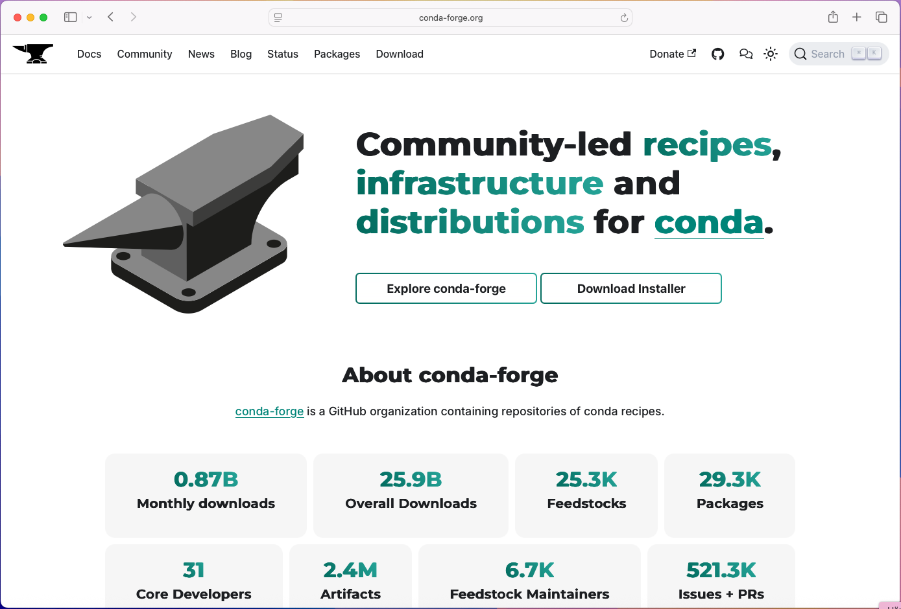

Click on the button **Download Installer**.

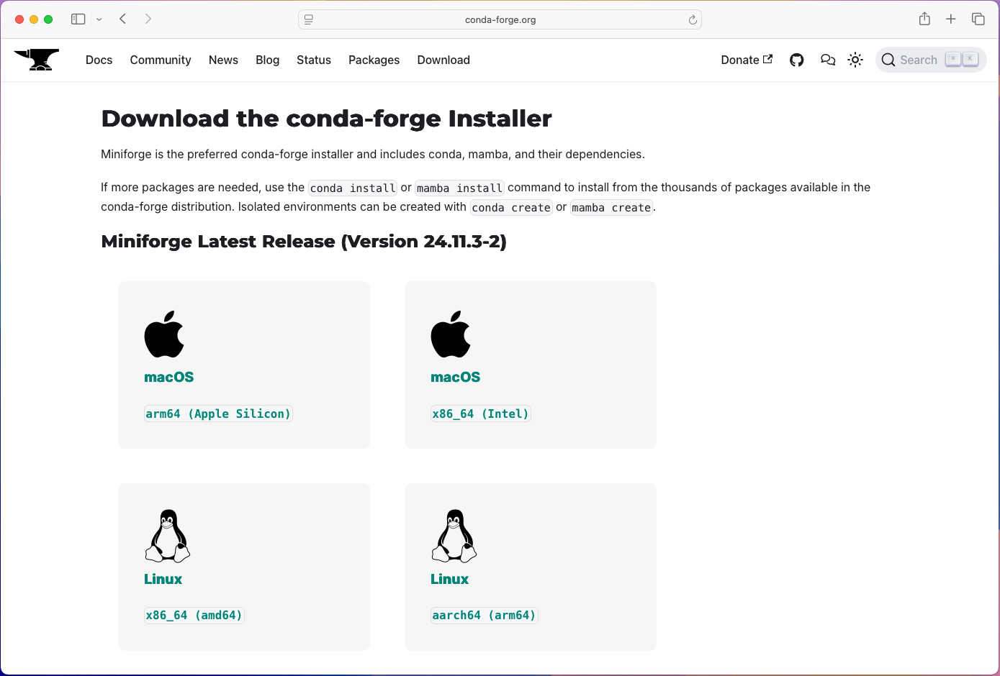

In this step it is important to now if you are using a Intel- or Apple Silicon Mac. If you are using a Intel Mac, click on the **macOS** Button to download the installer for Intel Macs. If you are using an Apple Silicon Mac, click on the **Apple Silicon** Button to download the installer for Apple Silicon Macs.

Step 2: Installing Conda-Forge
^^^^^^^^^^^^^^^^^^^^^^^^^^^^^^

When the download completed the installation needs to be completed in a Terminal. To open a Terminal, press **Command** + **Space** and type in **Terminal**. This will open the Terminal application.

In the terminal we need to navigate to the folder where the installer was downloaded. By default, this is the **Downloads** folder. To navigate to the Downloads folder, run the following command in the terminal:

.. code-block:: bash

   cd ~/Downloads

We are now ready to start the installer. The installer is a `.sh` file. To start the installation, run the following command in the terminal:

.. code-block:: bash

   sh Miniforge3-MacOSX-arm64.sh

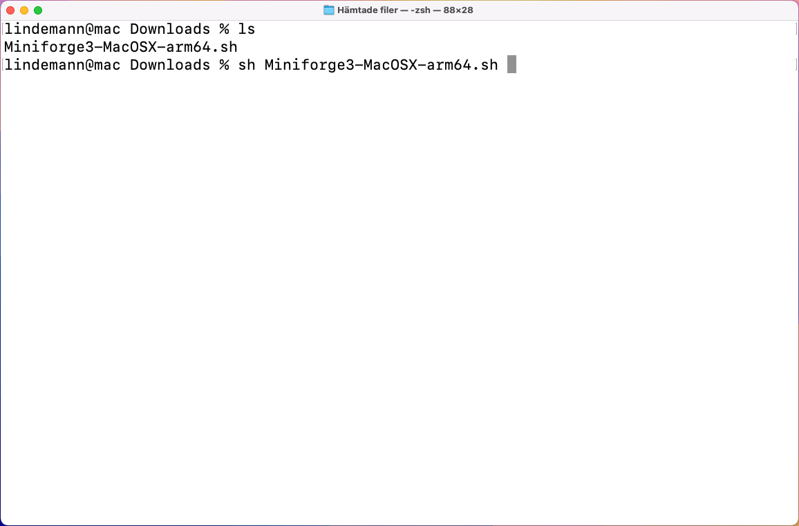

When the installer starts it shows the license agreement. To accept the license agreement, we need to move down in the text. To do this, press the **Space** key until the end of the license agreement is reached. After that, type in **yes** and press **Enter** to accept the license agreement.

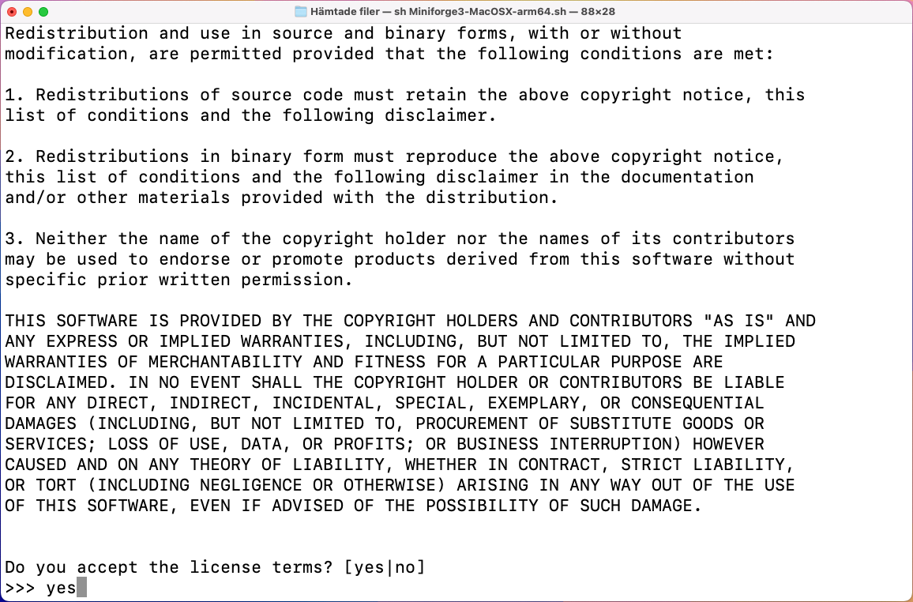

Next you will be asked where to install Conda-Forge. By default, it will be installed in the home directory under the folder **miniforge3**. To accept the default location, press **Enter**. If you want to change the location, type in the new location and press **Enter**.

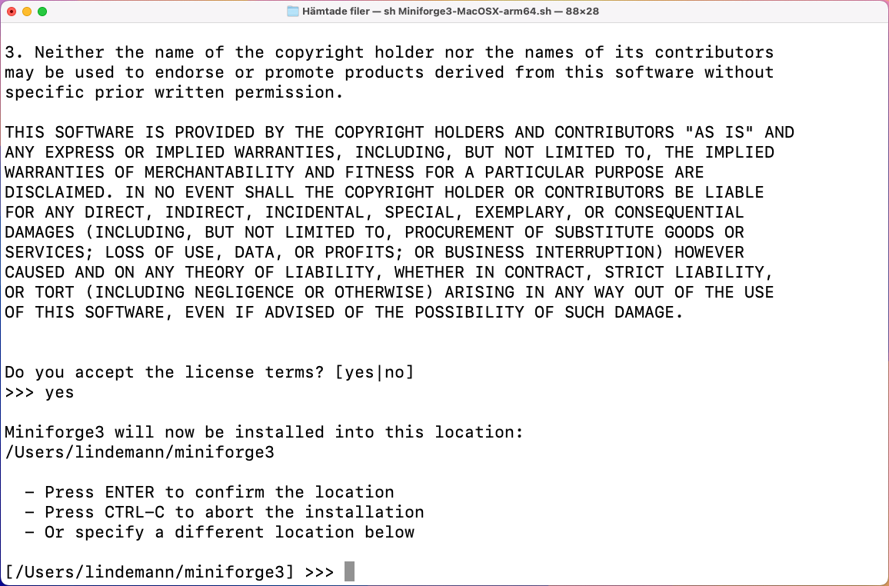

The installer now downloads the required packages. Finally it asks if you would like to configure the shell to use conda by default. This is recommended, so type in **yes** and press **Enter**.

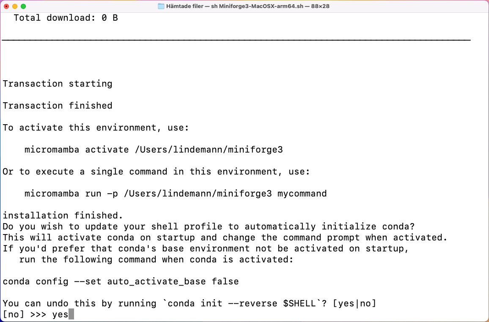

The installation is now complete. Before we use the Conda-Forge, we need to restart the terminal. To do this, close the terminal and open it again. 

The new terminal should look like this:

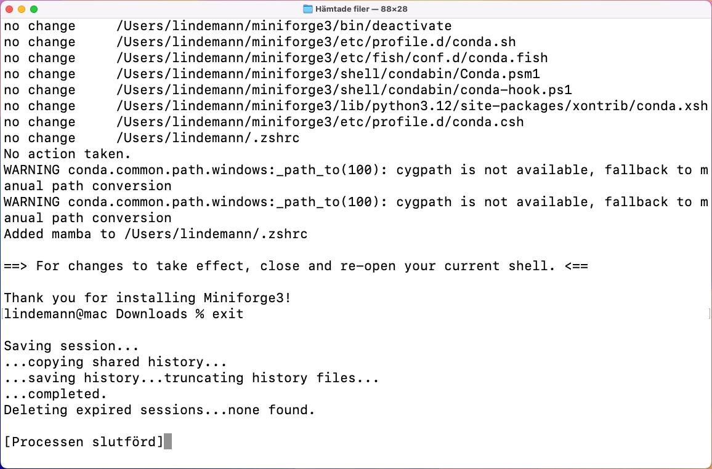

That is there should be a prompt with `(base)` in front of it. This indicates that the Conda-Forge is installed and ready to use.

Step 3: Creating an environment for this course
^^^^^^^^^^^^^^^^^^^^^^^^^^^^^^^^^^^^^^^^^^^^^^^

In the opened terminal we need to create a new environment for this course. An environment is a self contained Python installation with a set of packages. To create a new environment, run the following command in the terminal:

.. code-block:: bash

   conda create -n compute-env python=3.13 numpy scipy matplotlib qtpy pyqt

This will create a new environment called `compute-env` with Python 3.12 and the packages `numpy`, `scipy`, `matplotlib`, `qtpy` and `pyqt`. The command will also install all the dependencies required for these packages. 

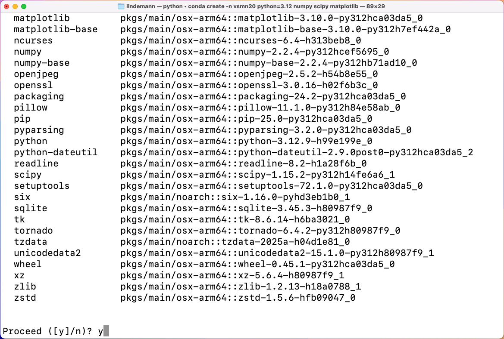

At some point during the installation, you will be asked if you want to proceed with the installation. Type in **y** and press **Enter** to proceed with the installation.

When the installation is complete, you will see a message indicating that the environment has been created and how to activate it.

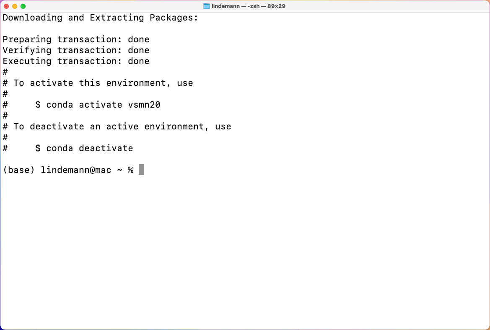

To continue our installation with the packages required for this course, we need to activate the environment. To do this, run the following command in the terminal:

.. code-block:: bash

   conda activate compute-env

This will activate the environment and change the prompt to indicate that the environment is active. The prompt should now look like this:

.. code-block:: bash

   (compute-env) user@computer:~$

Step 4: Testing the installation
^^^^^^^^^^^^^^^^^^^^^^^^^^^^^^^^

To test the installation, will open a Python interpreter. To do this, run the following command in the terminal:

.. code-block:: bash

   python

This will open the Python interpreter. The prompt should now look like this:

.. code-block:: bash

   >>> 

On this prompt we type in the following command to import CALFEM:

.. code-block:: python

   >>> import numpy as np

This should return without any error messages. To get some information about the installed version of numpy, type in the following command:

Step 5: Installing Visual Studio Code
^^^^^^^^^^^^^^^^^^^^^^^^^^^^^^^^^^^^^

To install Visual Studio Code, go to the `Visual Studio Code page <https://code.visualstudio.com>`_ and download the installer for macOS. Clicking on the Mac download button should automatically select the correct version for your system.

The download comes in the form of a `.zip` file. 

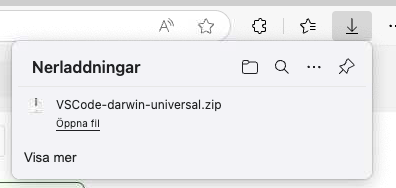

Open the **Downloads** folder. It should look like this:

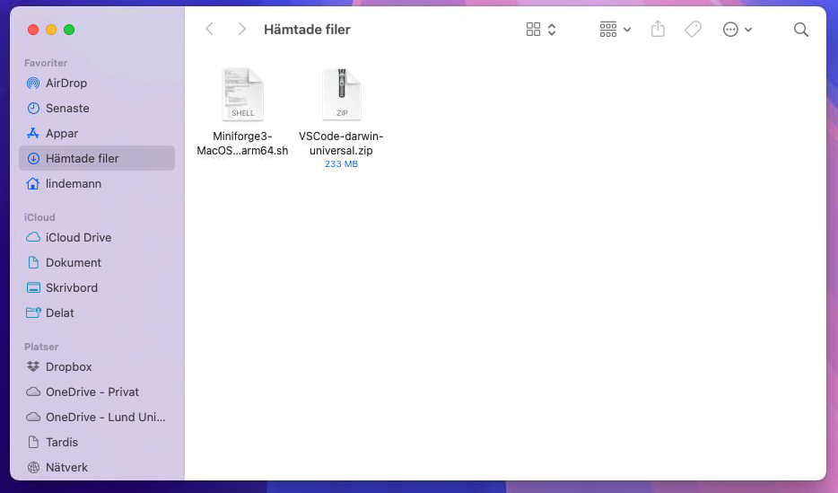

Double click on the downloaded file. This will extract the contents of the zip file. You should see a new icon called **Visual Studio Code**. 

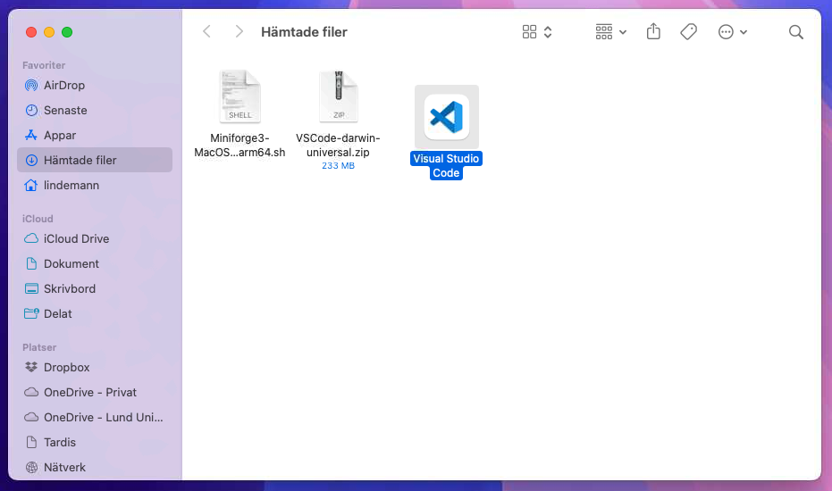

Drag the **Visual Studio Code** icon to the **Applications** folder. This will copy the application to the Applications folder.

To open Visual Studio Code, go to the **Applications** folder and double click on the **Visual Studio Code** icon. You can also search for Visual Studio Code in the **Spotlight** search by pressing **Command** + **Space** and typing in **Visual Studio Code**.

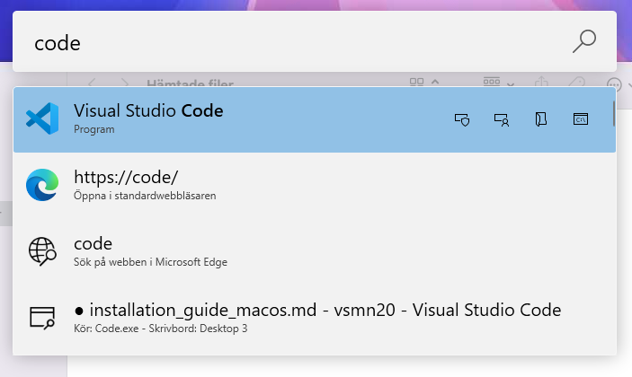

When you open Visual Studio Code for the first time, you will see a welcome screen. You can close this screen by clicking on the **X** in the top right corner.

Step 6: Installing the Python extension for Visual Studio Code
^^^^^^^^^^^^^^^^^^^^^^^^^^^^^^^^^^^^^^^^^^^^^^^^^^^^^^^^^^^^^^

I the left toolbar click on the **Extensions** icon. This will open the extensions view.

In the search box enter **Python**. This will show the Python extension for Visual Studio Code.
Click on the **Install** button to install the extension.

Next, create a new file by clicking on the **File/New file...** in the menu. This will open a file type selection dialog.

In the file type selection dialog select **Python**. This will create a new Python file.

In the next step we will need to select the Python interpreter. This is the Python version that will be used to run the code. To select the Python interpreter, click on the **Select interpreter** icon in the bottom right corner of Visual Studio Code.

This will open a list of available Python interpreters. Select the one that corresponds to the `compute-env` environment we created earlier. This should be something like `C:\Users\YourUsername\Miniforge3\envs\compute-env\python.exe`.

When this has been done, everytime you open a Python file in Visual Studio Code, it will show a play button in the top right corner. This will run the code in the file using the selected Python interpreter. Below shows what happens when you click on the play button.

.. image:: images/vc-install-16.png
   :alt: Visual Studio Code

